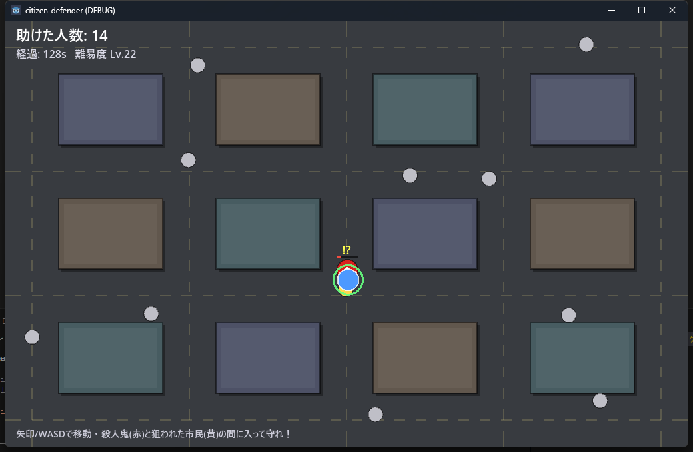

# citizen-defender（市民を守れ）

殺人鬼から街の市民を守る 2D アクションゲーム。Godot 4.6 製。

## 遊び方

- **矢印キー / WASD** でプレイヤー（青）を移動
- 殺人鬼（赤）は市民（灰）を狙い、近づくと攻撃する。狙われた市民は**黄色**になり頭上に HP バーが出る
- 殺人鬼と狙われた市民の**間に割り込む**と妨害成立。殺人鬼は「!?」と混乱して立ち止まり、ゲージが溜まりきると諦めて**大ジャンプで退散**する＝**救助成功**
- 市民を 1 人でも殺されたら**ゲームオーバー**。助けた人数がスコア
- 時間が経つほど殺人鬼の動きが速くなる（難易度逓増）

## 特徴

- **建物は通行不可の障害物**。道だけを歩けるので位置取りが攻防の鍵
- 殺人鬼は建物に阻まれると**大ジャンプで飛び越え**、別の場所に着地して狙い直す
- グラフィックは全て `_draw()` のコード描画、効果音は PCM をコード合成（**画像・音声アセット0**）

## 構成

- `Main.tscn` … Node2D 1個だけの薄いシーン
- `Main.gd` … ゲームロジック・描画・効果音すべて
- `resource/` … README 用スクショなど（Godot の取り込み対象外）

## 実行

Godot 4.6 でプロジェクトを開いて実行（F5）。メインシーンは `Main.tscn`。
